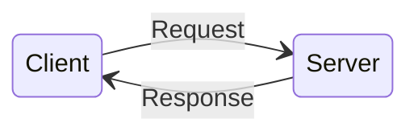

# HTTP



<style>
h1 {
  background-color: #2B90B6;
  background-image: linear-gradient(45deg, #4EC5D4 10%, #146b8c 20%);
  background-size: 100%;
  -webkit-background-clip: text;
  -moz-background-clip: text;
  -webkit-text-fill-color: transparent;
  -moz-text-fill-color: transparent;
}
</style>

<!--
The client sends a request to the server.

The server processes the request, then sends a response back to the client.

Both the client and the server are applications connected to the web.
-->

---
theme: seriph
---

# HTTP URL

- _Scheme_ - the type of web address
- _Domain_ - a human-readable identifier for the web server
- _Path_ - the location to the resource on the web server
- _Query Parameters_ - additional metadata sent with the request

<br />
<br />
<br />

<a href="https://jsonplaceholder.typicode.com/todos/?userId=4&completed=true" target="_blank">
  <div style="display: flex">
    <div style="display: inline-block">
      <p class="scheme">https://</p>
      <p class="scheme">scheme</p>
    </div>
    <div style="display: inline-block">
      <p class="domain">jsonplaceholder.typicode.com</p>
      <p class="domain">domain</p>
    </div>
    <div style="display: inline-block">
      <p class="path">/todos/</p>
      <p class="path">path</p>
    </div>
    <div style="display: inline-block">
      <p class="query-params">?userId=4&completed=true</p>
      <p class="query-params">query parameters</p>
    </div>
  </div>
</a>

<style>
h1 {
  background-color: #2B90B6;
  background-image: linear-gradient(45deg, #4EC5D4 10%, #146b8c 20%);
  background-size: 100%;
  -webkit-background-clip: text;
  -moz-background-clip: text;
  -webkit-text-fill-color: transparent;
  -moz-text-fill-color: transparent;
}
.scheme {
  color: magenta;
  text-align: center;
  margin: 0;
}
.domain {
  color: orange;
  text-align: center;
  margin: 0;
}
.path {
  color: cyan;
  text-align: center;
  margin: 0;
}
.query-params {
  color: coral;
  text-align: center;
  margin: 0;
}
</style>

<!--
The URL is a reference to a specific resource on the server.

The resource can be any entity relevant to the domain of the application:
- a book
- a car
- a course
- a student
-->

---
theme: seriph
---

# HTTP Request Methods
- GET - retrieve a representation of the resource
- POST - creates a resource
- PUT - update the resource, replacing its entire content
- PATCH - partially update a resource
- DELETE - delete the resource

<br />
<hr />
<br />

# HTTP Request Body
- JSON
- XML

<style>
h1 {
  background-color: #2B90B6;
  background-image: linear-gradient(45deg, #4EC5D4 10%, #146b8c 20%);
  background-size: 100%;
  -webkit-background-clip: text;
  -moz-background-clip: text;
  -webkit-text-fill-color: transparent;
  -moz-text-fill-color: transparent;
}
</style>

<!--
HTTP Methods
- operations that can be performed on a specific resource
-->

---
theme: seriph
---

# Example

```http
# Get Request
GET https://jsonplaceholder.typicode.com/todos/18 HTTP/1.1
```

<br/>

```http
# Post Request
POST https://jsonplaceholder.typicode.com/todos HTTP/1.1
Content-Type: application/json

{
  "userId": 1,
  "title": "lorem ipsum",
  "completed": false
}
```

<style>
h1 {
  background-color: #2B90B6;
  background-image: linear-gradient(45deg, #4EC5D4 10%, #146b8c 20%);
  background-size: 100%;
  -webkit-background-clip: text;
  -moz-background-clip: text;
  -webkit-text-fill-color: transparent;
  -moz-text-fill-color: transparent;
}
</style>

<!--
Get Request
- retrieve a representation of the todo resource with id=18

Post Request
- create a new todo resource in the todos collection
-->

---
theme: seriph
---

# HTTP Response Status Code
https://http.cat/

- 200 - OK
- 201 - Created
- 404 - Not Found
- 500 - Internal Server Error


<br />
<hr />
<br />

# HTTP Response Body
- JSON
- XML

<style>
h1 {
  background-color: #2B90B6;
  background-image: linear-gradient(45deg, #4EC5D4 10%, #146b8c 20%);
  background-size: 100%;
  -webkit-background-clip: text;
  -moz-background-clip: text;
  -webkit-text-fill-color: transparent;
  -moz-text-fill-color: transparent;
}
</style>

<!--
HTTP Response Status Code
- feedback from the server about the request

HTTP Response Body
- data sent back from the server
- JSON, XML
-->

---
theme: seriph
---

# Get todo with id=18

```http
# HTTP Request
GET https://jsonplaceholder.typicode.com/todos/18 HTTP/1.1
```

```http
# HTTP Response
HTTP/1.1 200 OK
Date: Fri, 20 Jan 2023 23:55:26 GMT
Content-Type: application/json; charset=utf-8
Transfer-Encoding: chunked
# ... (other headers) ...

{
  "userId": 1,
  "id": 18,
  "title": "dolorum est consequatur ea mollitia in culpa",
  "completed": false
}
```

<style>
h1 {
  background-color: #2B90B6;
  background-image: linear-gradient(45deg, #4EC5D4 10%, #146b8c 20%);
  background-size: 100%;
  -webkit-background-clip: text;
  -moz-background-clip: text;
  -webkit-text-fill-color: transparent;
  -moz-text-fill-color: transparent;
}
</style>

---
theme: seriph
---

# Create new todo

```http
# HTTP Request
POST https://jsonplaceholder.typicode.com/todos HTTP/1.1
Content-Type: application/json

{
  "userId": 1,
  "title": "lorem ipsum",
  "completed": false
}
```

```http
# HTTP Response
HTTP/1.1 201 Created
Date: Fri, 20 Jan 2023 23:57:51 GMT
Content-Type: application/json; charset=utf-8
Content-Length: 78
# ... (other headers) ...

{
  "userId": 1,
  "title": "lorem ipsum",
  "completed": false,
  "id": 201
}
```

<style>
h1 {
  background-color: #2B90B6;
  background-image: linear-gradient(45deg, #4EC5D4 10%, #146b8c 20%);
  background-size: 100%;
  -webkit-background-clip: text;
  -moz-background-clip: text;
  -webkit-text-fill-color: transparent;
  -moz-text-fill-color: transparent;
}
</style>
